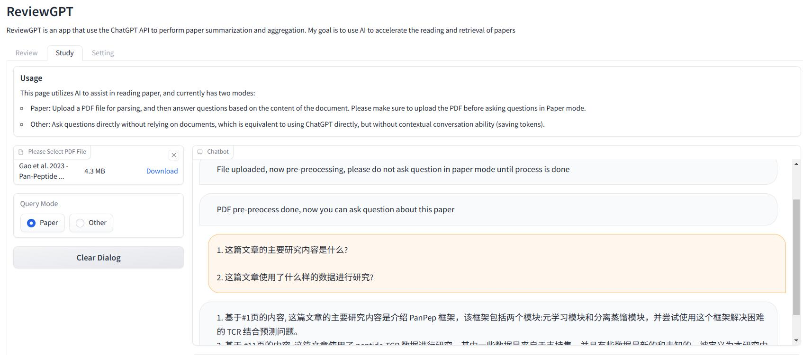

# ReviewGPT

Researchers need to read a large amount of literature every day to keep up with the latest research progress, but the fragmentation of research results is even worse than that of Linux distributions, which slows down research work to some extent. This project aims to use ChatGPT to perform some scientific literature retrieval and work during the reading process, so that related work can be faster and more efficient.

## Demo

[Demo](https://huggingface.co/spaces/SilenWang/ReviewGPT) available on Huggingface, an OpenAI API Key is required

- Screen:

- Summarise:

- Study:

## ToDo

- New feature planning:
  1. Automatically optimize prompts for the proposed topics/subjects and generate specific research tasks.
  2. Handle tasks by different agents.
  3. Aggregate the processing results of agents.

- Frontend:
  + [ ] Adjust the NiceGUI interface and beautify the layout
  + [ ] Add a download button for raw parsing data(json) 
  + [ ] The About page
- Backend: 
  + [ ] Save and package raw parsing data
  + [ ] Repalce LLM model
    + [ ] Kimi: for pdf reading
    + [ ] DeepSeek: for chat and asking question
    + [ ] Ollama: for chat and asking question
  + [ ] Add APIs for existing feature
  + [ ] Use kimi api for pdf parsing
- Others:
  - [ ] Dockfile for container building
