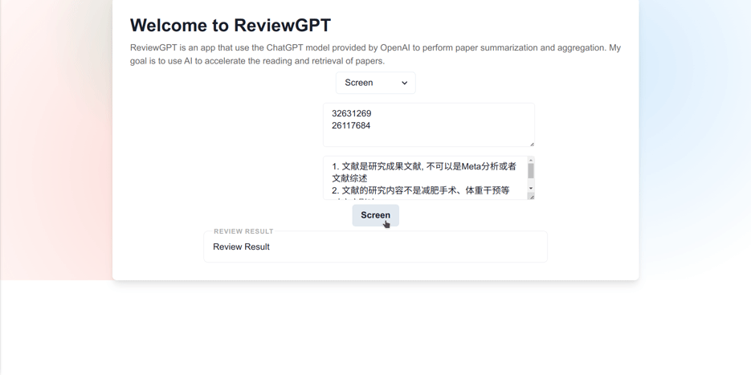
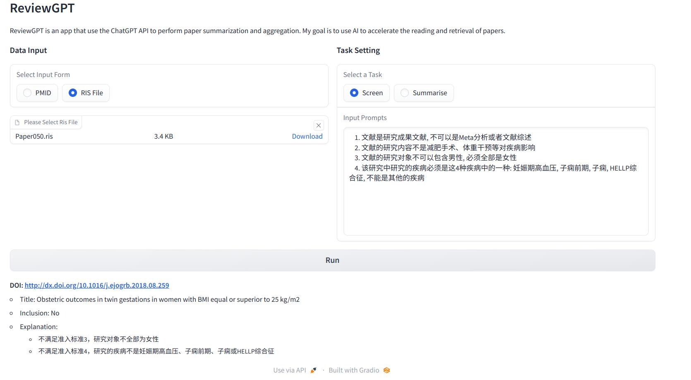

# ReviewGPT

Researchers need to read a large amount of literature every day to keep up with the latest research progress, but the fragmentation of research results is even worse than that of Linux distributions, which slows down research work to some extent. This project aims to use ChatGPT to perform some scientific literature retrieval and work during the reading process, so that related work can be faster and more efficient.

## Demo

- Literature entry judgment:

<!--  -->

## 规划内容

- Frontend:
  + [x] A basic app but usable app
  + [x] Setting key from frontend
  + [ ] Add a download button for raw parsing data(json) 
  + [ ] Implementation of content summary function
  + [ ] The About page
  + [ ] Add usage instructions
  + [ ] Add a page for reading single paper
- Backend: 
  + [x] Call the chatGPT API for content summarization
  + [x] Call the chatGPT API for literature content access judgment (for meta-analysis)
  + [x] Call the biopython API to obtain literature bibliographic information and abstracts from PUBMED
  + [ ] Save and package raw parsing data
    * Data security issues here, necessary to understand whether the returned id will cause Key leakage 
  + [ ] ~~Add multiple repetitions of content access judgment (check whether the result is stable)~~
  + [x] RIS file upload and parsing support
  + [ ] Support for models other than chatGPT
    + [ ] chatGLM
    + [ ] moss
    + [ ] LLaMA
  + [ ] Add the function of reading single paper
  + [ ] Add APIs for existing feature
- Reference learning:
  + [ ] Learn the content of[ResearchGPT](https://github.com/mukulpatnaik/researchgpt) and add similar function
  + [ ] Learn the content of[chatPaper](https://github.com/kaixindelele/ChatPaper) and add similar function
  + [ ] Try build something like [chatPDF](https://www.chatpdf.com/)
- Others:
  - [x] Enhlish README
  - [ ] Dockfile for container building
  - [ ] A HuggingFace demo

## 问题记录

- This project was initially developed using Pynecone, but encountered several problems that affected its use/appearance, so it was finally switched to Gradio.
  + pynecone continues to occupy the CPU after startup.
  + Currently, the file upload function is not very user-friendly, and you must use buttons or other content to trigger the upload (I have not found how to implement drag and drop upload).
  + After uploading the file, performing other operations will cause the displayed file name to be lost.