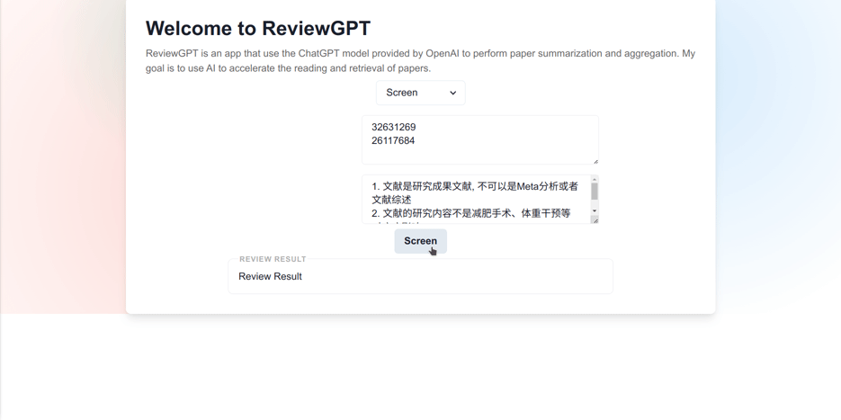
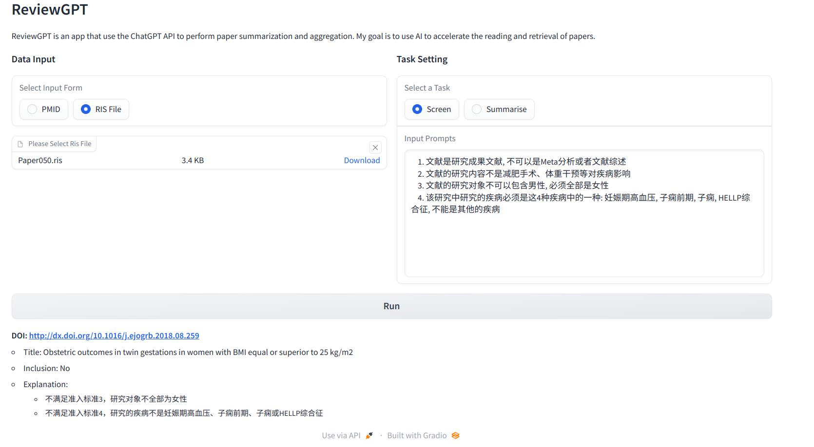

# ReviewGPT

科研人员日常需要对进行大量的文献阅读以跟进最新的研究进度, 但是研究结果的碎片化程度比Linux发行版更甚, 这一定程度上拖慢了科研工作的速度, 本项目旨在利用chatGPT完成一些科研文献检索, 阅读过程中的工作, 使相关工作能更快速高效.

## 运行展示

- 文献准入判断:

<!--  -->

## 规划内容

- 前端: 使用gradio构建简易WebAPP
  + [x] 一个勉强能用的基本App
  + [x] 前端设置API_KEY(安全问题咋保证?)
  + [ ] 增加原始解析数据下载按钮(json)
  + [ ] 内容综述功能实装
  + [ ] 增加About页
  + [ ] 增加使用说明(具体怎么加没想好)
  + [ ] 增加单文献阅读的页面
- 后端: 
  + [x] 调用chatGPT的API进行内容综述
  + [x] 调用chatGPT的API进行文献内容准入判断(Meta分析用)
  + [x] 调用biopython的API从PUBMED获取文献题录及摘要
  + [ ] 原始解析数据保存并打包
    * 这里有涉及数据安全问题, 需要了解下返回的id是否会导致Key泄露? 
  + [ ] ~~增加内容准入判断的多次重复(检查结果是否稳定)~~
  + [x] 增加RIS文件上传解析的支持
  + [ ] 增加chatGPT以外的模型支持
    + [ ] chatGLM
    + [ ] moss
    + [ ] LLaMA
  + [ ] 增加单文献阅读的功能
  + [ ] 增加现有功能的API
- 参考学习:
  + [ ] 学习[ResearchGPT](https://github.com/mukulpatnaik/researchgpt)的内容, 增加类似的功能
  + [ ] 学习[chatPaper](https://github.com/kaixindelele/ChatPaper)的内容, 增加类似的功能
  + [ ] 尝试构建个[chatPDF](https://www.chatpdf.com/)类似的功能
- 杂项:
  - [ ] 英文README
  - [ ] 准备Dockfile, 构建容器
  - [ ] 准备HuggingFace Demo

## 问题记录

- 本项目最初采用pynecone开发, 但是碰到了若干影响使用/观感的问题, 因此最后转到了gradio
  - pynecone启动后CPU持续占用
  - 目前上传文件功能不是特别好用, 必须要用按钮或其他内容来触发上传(没找到如何实现拖拽即上传)
  - 上传文件后, 进行其他操作会使得已显示的文件名丢失